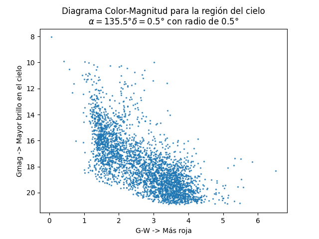

# Proyecto_2_MD

## Diagrama Color-Magnitud Misión A:

## Conclusiones Misión A:

* Al observar objetos en el infarrojo y en el óptico a partir de la unión de dos tablas de Vizier, fue posible observar un gran conjunto de estrellas en la región solicitada $\delta = 135$°, $\alpha=0.5$° en un radio de 0.5°. A partir de esto se pueden agrupar datos cinemáticos (como el paralaje y el movimiento propio) con datos astrométricos para identificar aquellas estrellas dentro de la galaxia, cuyo paralaje es mayor a 1/15 mas. 

* Con estas estrellas, se logró hacer un diagrama de color magnitud a partir de las bandas fotométricas $G$, correspondiente al visible, y $W1$, correspondiente al infrarrojo. Al realizar el diagrama, es posible identificar una línea gruesa, lo que indica que estamos observando un grupo estelar en el campo de visión mas no un cúmulo en específico. Además, como hay una línea diagonal dominante, esto significa que una gran parte de las estrellas observadas en esta región hacen parte de la secuencia principal.

### ¿Por qué es necesario cruzar el espectro óptico con el infrarrojo para tener una imagen completa del universo?

Para estrellas dentro de la galaxia, estas pueden ir perdiendo su brillo aparente a medida que la luz emitida viaja por el medio interestelar, por lo que al observar estrellas lejanas en la galaxia, el espectro infrarrojo es fundamental pues atraviesa estas nubes de polvo que de otra forma obstaculizan el paso de la luz en el óptico. En cambio, al observar objetos aún más distantes, de carácter extragaláctico, hay todavía más material que atravesar, por lo que el espectro en infrarrojo nos permite observar aquellos objetos que completan el mapa del universo. Es decir, al cruzar ambas bandas fotométricas se tiene una descripción más completa del universo gracias a la nueva información que cada una de las bandas puede proporcionar.
