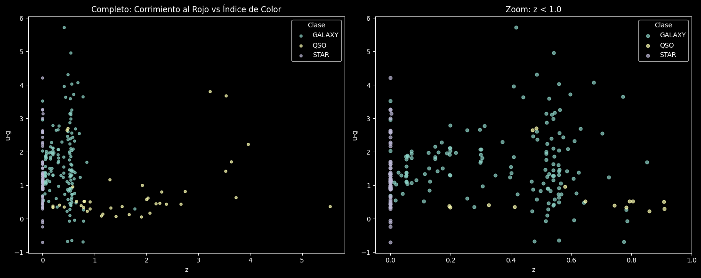
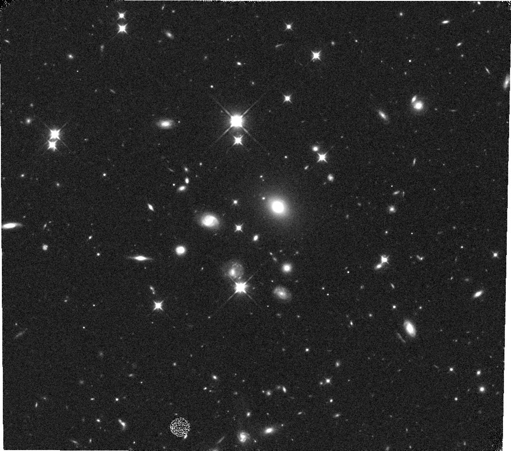

# Disección de un Campo Profundo Multi-Longitud de Onda

**Proyecto 2 · Minería de Datos**

**Autores:** Soleil Dayana Niño Murcia · Sean Paul Perdomo

[](https://colab.research.google.com/github/seanperdomo/Proyecto_2_MD/blob/main/main.ipynb)

---

## Resumen

Los astrónomos no suelen estudiar un objeto aislado: apuntan el telescopio a un parche de cielo (un "campo profundo") y extraen todo lo que hay en él usando distintas longitudes de onda. En este proyecto se analiza el campo ecuatorial centrado en **RA (α) = 135.5°, Dec (δ) = +0.5°**, con un **radio de 0.5°**, combinando astrometría, fotometría óptica e infrarroja y espectroscopía.

El trabajo se dividió en dos misiones que luego se integraron en `main`:

| Misión | Responsable | Archivo | Pregunta que responde |
|---|---|---|---|
| **A. El Cartógrafo Galáctico** | Estudiante A | `vizier_misionA.ipynb` | ¿Qué estrellas de nuestra galaxia hay en el campo y cómo se distribuyen en color y brillo? |
| **B. El Cosmólogo** | Estudiante B | `sdss_misionB.ipynb` | ¿Cómo se separan estrellas, galaxias y cuásares según su corrimiento al rojo y su color? |
| **Conjunta** | Ambos | `main.ipynb` | Integración de ambos pipelines y respuestas a las preguntas de cierre |

---

## Estructura del repositorio

```
Proyecto_2_MD/
├── main.ipynb              # Notebook final con Misión A, Misión B y conclusiones conjuntas
├── vizier_misionA.ipynb    # Pipeline individual de la Misión A (rama pipeline_vizier)
├── sdss_misionB.ipynb      # Pipeline individual de la Misión B (rama pipeline_sdss)
├── cmd_1.png               # Diagrama color-magnitud (Misión A)
├── cmd_2.png               # Corrimiento al rojo vs u-g (Misión B)
├── Hubble_image.jpg        # Imagen HST encontrada en MAST
├── JWST view.png           # Captura de la búsqueda en MAST sobre el campo
└── README.md
```

El flujo de trabajo en Git fue: una rama por misión (`pipeline_vizier` y `pipeline_sdss`), un Pull Request por rama y fusión final en `main`.

---

## Misión A: El Cartógrafo Galáctico (VizieR)

### Datos y consulta

Se envió una consulta ADQL al servicio TAP de VizieR desde una celda de Bash en Colab. La consulta cruza **Gaia DR3** (`I/355/gaiadr3`, astrometría óptica) con **AllWISE** (`II/328/allwise`, fotometría infrarroja) con un radio de coincidencia de 2 arcosegundos (0.00056°), y restringe ambos catálogos al cono del campo profundo.

```sql
SELECT TOP 5000 g.Gmag, g.Plx, g.PMRA, g.PMDE, w.W1mag
FROM "I/355/gaiadr3" AS g
INNER JOIN "II/328/allwise" AS w
  ON 1=CONTAINS(POINT('ICRS', w.RAJ2000, w.DEJ2000),
                CIRCLE('ICRS', g.RA_ICRS, g.DE_ICRS, 0.00056))
WHERE 1=CONTAINS(POINT('ICRS', w.RAJ2000, w.DEJ2000), CIRCLE('ICRS', 135.5, 0.5, 0.5))
  AND 1=CONTAINS(POINT('ICRS', g.RA_ICRS, g.DE_ICRS), CIRCLE('ICRS', 135.5, 0.5, 0.5))
```

Variables extraídas: magnitud en la banda $G$ (`Gmag`), paralaje (`Plx`), movimientos propios (`PMRA`, `PMDE`) y magnitud infrarroja $W1$ (`W1mag`).

### Limpieza y selección de estrellas galácticas

1. Se eliminaron las filas con datos faltantes (`dropna`), quedando **3379 objetos**.
2. Se tomó 15 kpc como radio de la galaxia. Como el paralaje en mas (milisegundos de arco) es $1/d$ con $d$ en kpc, el corte es $\varpi > 1/15 \approx 0.067$ mas. Con él quedan **3054 estrellas** pertenecientes a la Vía Láctea.
3. Se calculó el índice de color $G - W1$, que combina una banda óptica con una infrarroja.

### Resultado: diagrama color-magnitud óptico-infrarrojo

<!-- Gráfica Misión A -->


*Diagrama color-magnitud para la región $\alpha = 135.5°$, $\delta = 0.5°$ con radio de 0.5°. El eje vertical (Gmag) está invertido, de modo que lo más brillante queda arriba.*

### Conclusiones de la Misión A

* El cruce de Gaia con AllWISE permitió reunir datos cinemáticos (paralaje, movimiento propio) y fotométricos (óptico e infrarrojo) para un gran conjunto de estrellas en la región, y aislar con el paralaje las que pertenecen a nuestra galaxia.
* El diagrama muestra una banda gruesa y no una secuencia delgada. Esto indica que se observa una población estelar mezclada a lo largo de la línea de visión y no un cúmulo específico, cuyas estrellas compartirían distancia y edad y trazarían una secuencia mucho más estrecha.
* Hay una diagonal notable, lo que sugiere que buena parte de las estrellas del campo pertenecen a la secuencia principal.

---

## Misión B: El Cosmólogo (SDSS y MAST)

### Datos y consulta

Se consultó el SkyServer de SDSS (DR18) desde una celda de Bash. Se hizo un `INNER JOIN` relacional entre la fotometría (`PhotoObj`) y la espectroscopía (`SpecObj`) enlazadas por `bestObjID`, limitado al mismo cono de la Misión A. En SkyServer el cono se define con `dbo.fGetNearbyObjEq(ra, dec, radio)`, cuyo radio va en **arcominutos**, por eso 0.5° equivalen a 30′.

```sql
SELECT s.specObjID, s.class, s.z, p.objID, p.ra, p.dec, p.u, p.g
FROM dbo.fGetNearbyObjEq(135.5, 0.5, 30) AS n
JOIN PhotoObj AS p ON p.objID = n.objID
JOIN SpecObj  AS s ON s.bestObjID = p.objID
WHERE p.u > -9999 AND p.g > -9999
```

El filtro `> -9999` descarta los valores centinela de magnitudes sin medida. El resultado son **250 objetos con espectro** clasificados por SDSS como `STAR`, `GALAXY` o `QSO`. Con ellos se calculó el índice de color $u - g$ (ultravioleta menos verde).

### Resultado: corrimiento al rojo vs. índice de color

<!-- Gráfica Misión B -->


*Izquierda: panorama completo. Derecha: ampliación en $z < 1$. Cada clase espectroscópica tiene un color distinto.*

### Conclusiones de la Misión B

* **Estrellas (`STAR`).** Se agrupan en $z \approx 0$, como corresponde a objetos de la Vía Láctea, que no sienten la expansión cosmológica. Su $u-g$ cubre un rango amplio, de aproximadamente 0 a 4, reflejo de la variedad de temperaturas y tipos espectrales, desde estrellas calientes hasta enanas frías.
* **Galaxias (`GALAXY`).** Se distribuyen sobre todo entre $0 < z < 0.8$. Al aumentar $z$ tienden a un $u-g$ mayor (más rojas). El corrimiento al rojo desplaza el espectro hacia longitudes de onda mayores.
* **Cuásares (`QSO`).** Abarcan un rango de redshift mucho mayor, hasta $z \approx 5.5$ en este campo. Pese a su enorme distancia, muchos mantienen un $u-g$ bajo (alrededor de 0.5), consistente con una emisión dominada por el disco de acreción del agujero negro supermasivo central, que radia mucho en el ultravioleta.

---

## Exploración en MAST: ¿hay imágenes de HST o JWST en el campo?

Se consultó la interfaz web de MAST en las coordenadas RA 135.5°, Dec +0.5° con un radio de 0.5°, buscando observaciones de alta resolución del Telescopio Espacial Hubble (HST) y del James Webb (JWST).

**Imagen de HST encontrada en el campo:**



**Vista de la búsqueda en MAST (círculo rojo: región de 0.5° de radio; cruz: centro del campo):**


---

## Misión conjunta: integración y conclusiones

### ¿Por qué cruzar el espectro óptico con el infrarrojo?

La luz de las estrellas lejanas dentro de la galaxia pierde brillo al atravesar el medio interestelar, y el polvo bloquea con más fuerza la luz óptica que la infrarroja. El infrarrojo atraviesa esas nubes y recupera información que el óptico no alcanza. Con los objetos extragalácticos pasa algo similar, y con más material de por medio, de modo que el infrarrojo permite observar objetos que completan el mapa del universo. Cruzar ambas bandas da una descripción más completa, porque cada una aporta información que la otra no tiene.

### ¿Cómo se complementan Gaia y SDSS?

Las dos herramientas responden preguntas distintas y se confirman mutuamente.

* **Gaia: ¿qué tan lejos está y cómo se mueve?** Mide paralaje y movimiento propio. Un cuásar queda tan lejos que ambos valores tienden a cero, por eso Gaia usa cuásares como puntos de referencia. Pero una galaxia lejana, o una estrella débil con mediciones ruidosas, también puede parecer inmóvil. Gaia indica que el objeto está lejos, pero no puede clasificarlo.
* **SDSS: ¿qué es y qué tan lejos está realmente?** El espectro deja una huella distinta según el objeto. Una estrella muestra líneas de absorción y un corrimiento al rojo casi nulo. Un cuásar muestra líneas de emisión muy anchas y desplazadas hacia el rojo, producidas por gas que gira a gran velocidad alrededor de un agujero negro supermasivo. Ese desplazamiento mide cuánto se expandió el universo mientras la luz viajaba, y de ahí se obtiene también el tiempo de viaje.
* **En conjunto.** Para un cuásar se espera que Gaia no detecte paralaje ni movimiento y que SDSS muestre líneas anchas con $z$ alto. Para una estrella ocurre lo contrario: Gaia mide paralaje y movimiento claros y SDSS da $z \approx 0$. Cuando una de las pruebas es ambigua, la otra desempata.

---

   VizieR a veces devuelve error 503 por mantenimiento o sobrecarga. Si pasa, basta reintentar más tarde.

---

## Notas y limitaciones

* **Tipo de cruce en la Misión A.** La consulta usa `INNER JOIN` y no el `LEFT JOIN` descrito en el enunciado. Como el diagrama color-magnitud necesita `W1mag` y las filas sin dato se eliminan con `dropna`, la muestra final es la misma en ambos casos.
* **Corte de paralaje.** El criterio $\varpi > 1/15$ mas no considera el error del paralaje, así que la muestra incluye medidas poco significativas.
* **Muestra espectroscópica.** Los 250 objetos de la Misión B son los que SDSS decidió observar con espectro, no un censo completo del campo. Los huecos en la gráfica no implican ausencia real de objetos.
* **Fotometría.** Las magnitudes $u$ y $g$ se usaron sin corrección por extinción galáctica ni filtros de calidad, por lo que algunos colores extremos pueden deberse a ruido fotométrico, sobre todo en la banda $u$.
